# 🤖 CustomerPulse AI  
## Intelligent Customer Feedback Analysis System Using Deep Learning and Natural Language Processing

---

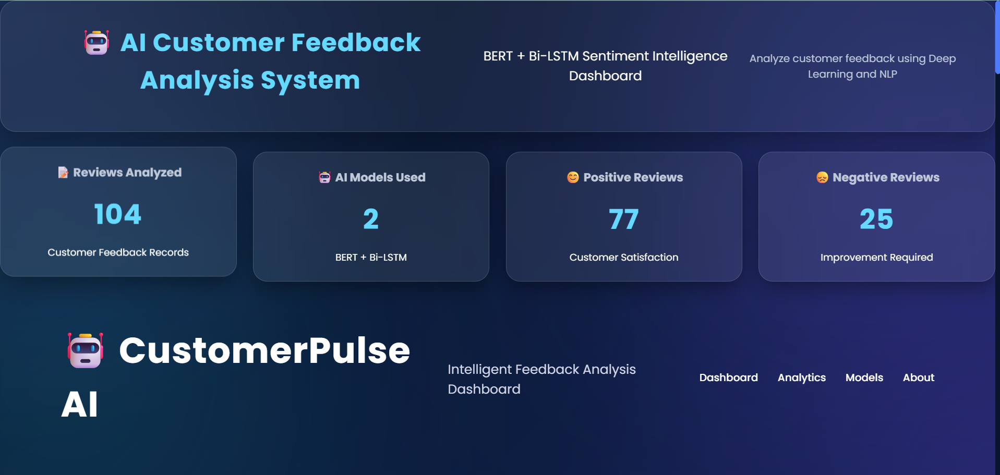

---

## 📌 Project Overview

CustomerPulse AI is an Artificial Intelligence-based customer feedback analysis system that automatically analyzes customer reviews and identifies sentiment using Deep Learning and Natural Language Processing (NLP).

The system uses advanced AI models such as **BERT** and **Bi-LSTM** to understand customer opinions, classify sentiments, and generate meaningful insights through an interactive dashboard.

The project helps organizations analyze customer satisfaction, identify improvement areas, and support data-driven decision-making.

---

# 🎯 Objectives

The main objectives of CustomerPulse AI are:

- To develop an AI-based customer feedback analysis system.
- To preprocess and analyze customer review text using NLP techniques.
- To implement BERT and Bi-LSTM deep learning models.
- To classify customer reviews into sentiment categories.
- To compare AI model performance.
- To provide an interactive dashboard for visualization and analysis.

---

# ✨ Features

## Customer Review Analysis
- Accepts customer review text as input.
- Performs automatic sentiment prediction.

## AI Sentiment Classification
- Positive sentiment detection.
- Negative sentiment detection.
- Neutral sentiment detection.
- Mixed sentiment handling.

## Deep Learning Models

### BERT Model
- Transformer-based language model.
- Understands contextual meaning of words.
- Provides accurate sentiment prediction.

### Bi-LSTM Model
- Bidirectional Long Short-Term Memory network.
- Captures sequential relationships in text.
- Used for sentiment classification.

## Dashboard Features

- Total reviews analyzed.
- Positive and negative review statistics.
- AI model comparison.
- Confidence score visualization.
- Review analysis history.
- Final AI decision dashboard.

---

# 🏗️ System Workflow

```
Customer Review Input
          ↓
Text Preprocessing
          ↓
NLP Processing
          ↓
BERT Model + Bi-LSTM Model
          ↓
Prediction Comparison
          ↓
Correction Layer
          ↓
Final AI Decision
          ↓
Dashboard Visualization
```

---

# 🔄 NLP Processing Pipeline

```
Review Text
      ↓
Tokenization
      ↓
Embedding Generation
      ↓
BERT / Bi-LSTM Processing
      ↓
Classification
      ↓
Sentiment Result
```

---

# 🛠️ Technology Stack

| Category | Technologies |
|----------|--------------|
| Programming Language | Python |
| Backend Framework | Flask |
| Frontend | HTML, CSS, JavaScript |
| Natural Language Processing | NLP |
| Deep Learning Models | BERT, Bi-LSTM |
| Machine Learning | Scikit-learn |
| Data Processing | Pandas, NumPy |
| Visualization | Dashboard Interface |

---

# 📂 Project Structure

```
AI_Customer_Feedback_Analysis

│
├── dataset/
│
├── models/
│   ├── BERT Model
│   └── Bi-LSTM Model
│
├── results/
│
├── screenshots/
│
├── static/
│   ├── dashboard.css
│   ├── dashboard.js
│   └── style.css
│
├── templates/
│   ├── index.html
│   └── dashboard.html
│
├── app.py
├── bert_model.py
├── lstm_model.py
├── preprocessing.py
├── language_rules.py
├── history.json
├── stats.json
├── requirements.txt
└── README.md
```

---

# ⚙️ Installation and Setup

## Step 1: Clone Repository

```bash
git clone <repository-url>
```

## Step 2: Navigate to Project Folder

```bash
cd AI_Customer_Feedback_Analysis
```

## Step 3: Create Virtual Environment

```bash
python -m venv .venv
```

## Step 4: Activate Virtual Environment

For Windows:

```bash
.venv\Scripts\activate
```

## Step 5: Install Required Libraries

```bash
pip install -r requirements.txt
```

---

# ▶️ Running the Application

Run the Flask application:

```bash
python app.py
```

The application will start at:

```
http://127.0.0.1:5000/
```

Open the URL in your browser to access the dashboard.

---

# 📊 Model Performance

## BERT Model

- Transformer-based architecture.
- Provides better contextual understanding.
- Achieves higher accuracy for complex reviews.

## Bi-LSTM Model

- Recurrent neural network architecture.
- Processes text sequences in both directions.
- Effective for sentiment analysis.

### Performance Comparison

| Model | Accuracy |
|------|----------|
| BERT | 93.8% |
| Bi-LSTM | 89.6% |

---

# 🧪 Testing

The system was tested using different customer reviews:

### Positive Review

Example:

"Excellent product quality and fast delivery."

Output:

😊 Positive Sentiment

---

### Negative Review

Example:

"Poor service and damaged product."

Output:

😞 Negative Sentiment

---

### Neutral Review

Example:

"The product is available in three different colors."

Output:

😐 Neutral Sentiment

---

### Mixed Review

Example:

"The design is good but the battery performance is poor."

Output:

Mixed Sentiment Analysis

---

# 📸 Screenshots

## 🏠 Home Dashboard


---

## 📝 Customer Review Input
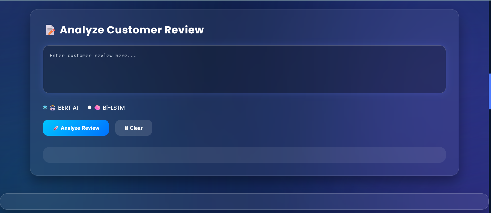

---

## 🤖 Sentiment Analysis Overview


---

## 😊 Positive Sentiment Result
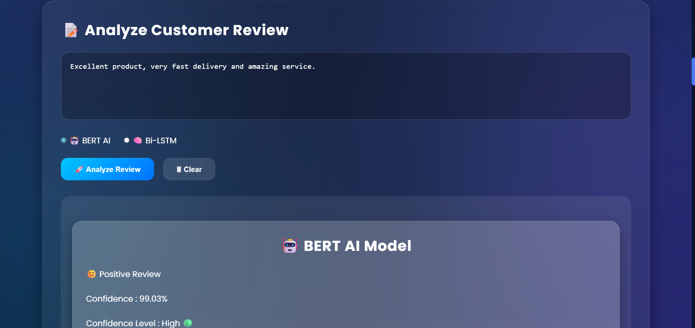

---

## 😞 Negative Sentiment Result
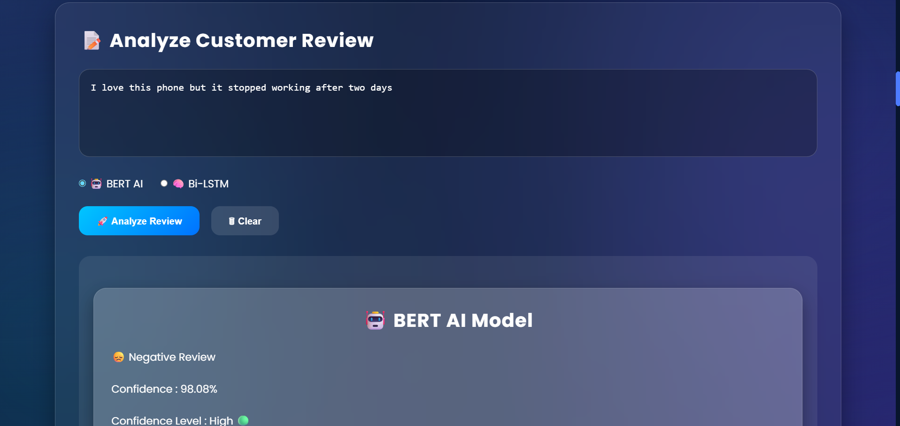

---

## 🔀 Mixed Sentiment Detection
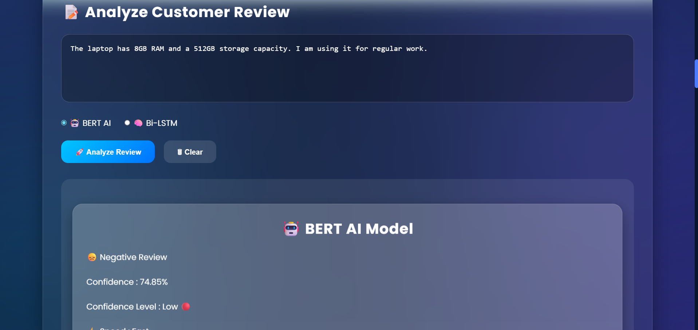

---

## 📊 AI Model Comparison (BERT vs Bi-LSTM)
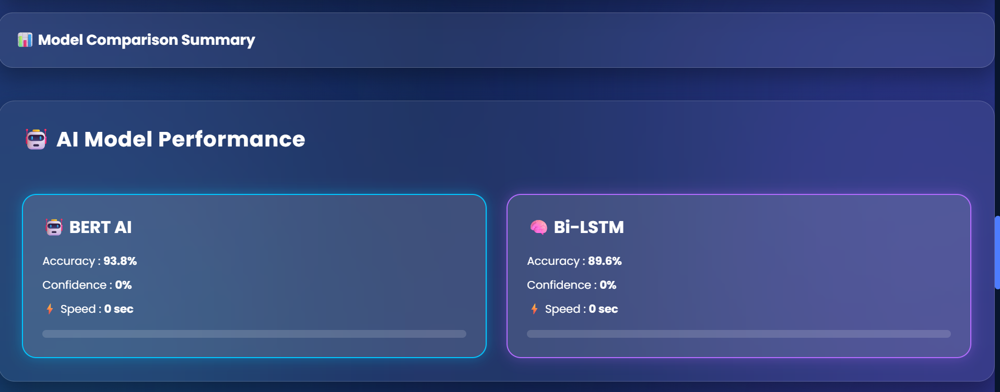

---

## 🎯 Confidence Score Visualization
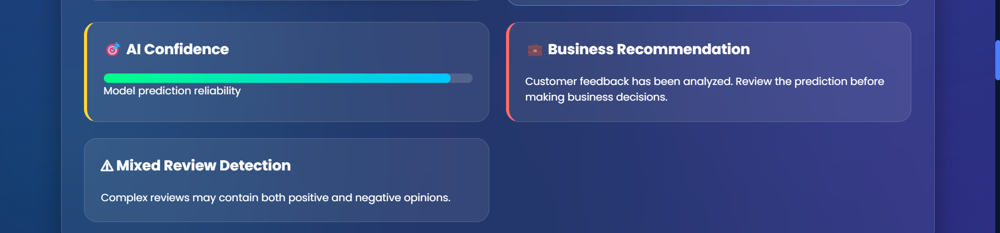

---

## 🧠 Final AI Decision Dashboard
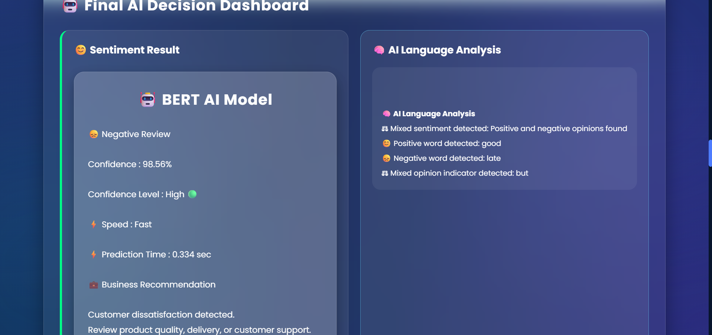

---

## 📜 Review Analysis History
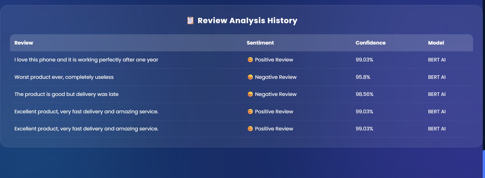

---

## 📈 Analytics Dashboard
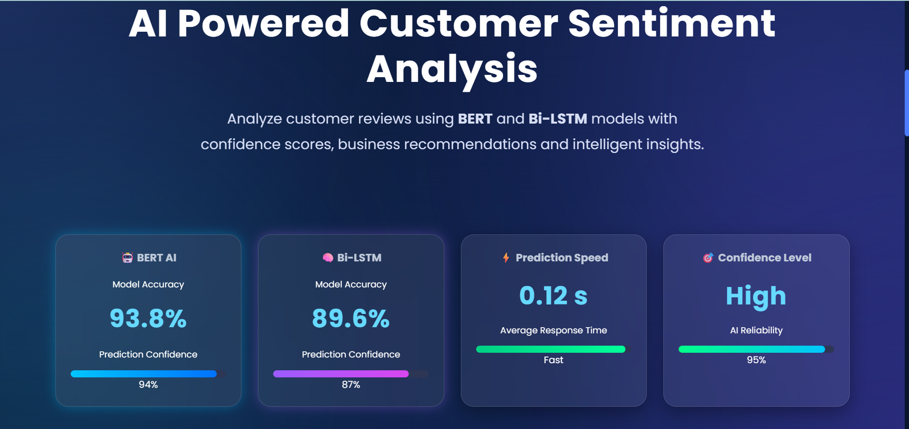

---

## ℹ️ About Section
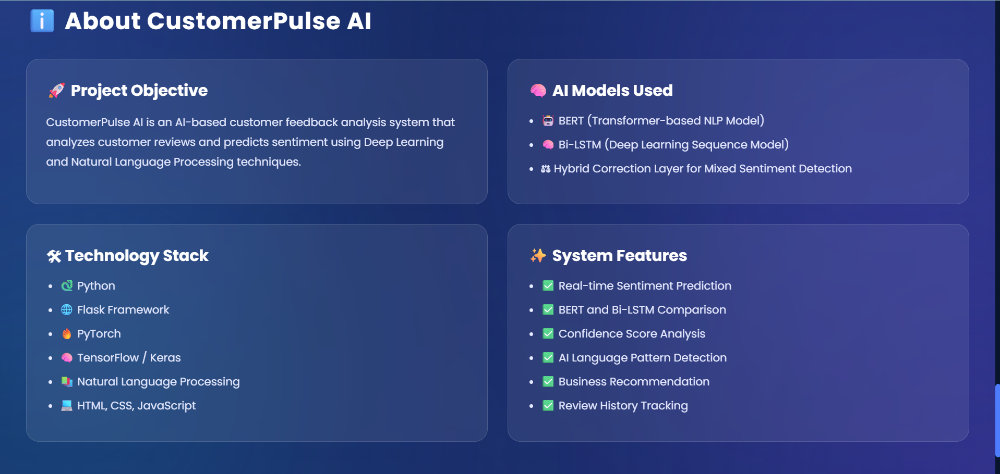

---

# 🚀 Future Scope

Future improvements include:

- Real-time customer feedback monitoring.
- Multilingual sentiment analysis.
- Cloud-based deployment.
- Mobile application integration.
- Integration with e-commerce platforms.
- Advanced Large Language Model (LLM) based analysis.

---

# 👩‍💻 Author

**Adiba Khan**

Bachelor of Technology  
Department of Computer Science and Engineering


# 📄 License

This project is developed for academic internship purposes.

## Note
Due to large file size limitations, trained AI models and datasets are not included in this repository.
The models can be generated by running the training scripts.