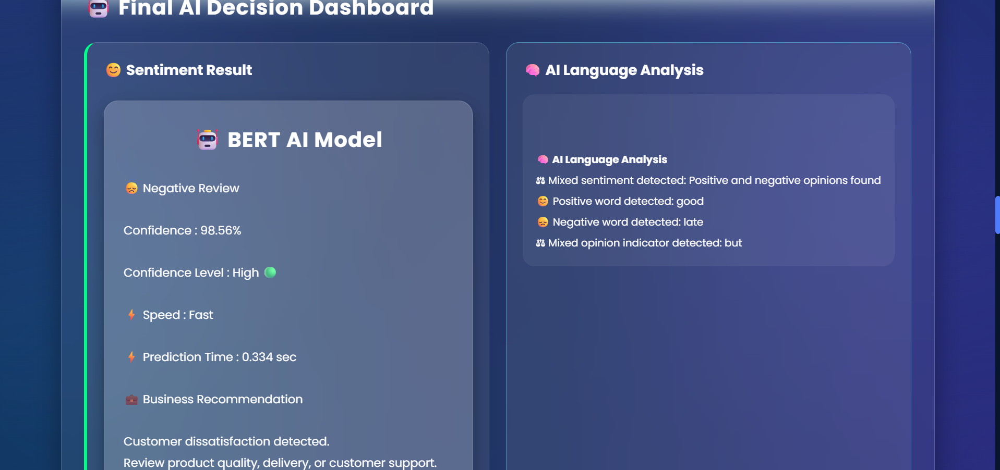

# 🤖 CustomerPulse AI

## AI-Based Customer Feedback Analysis System for Business Decision Making

<p align="center">
  
</p>

<p align="center">
  <b>AI-powered customer feedback analysis using NLP, BERT, Bi-LSTM and Flask</b>
</p>

---

## 📌 Project Overview

**CustomerPulse AI** is an AI and Natural Language Processing based full-stack web application that analyzes customer feedback and converts unstructured reviews into structured business insights.

The system uses **BERT** and **Bi-LSTM** based approaches for sentiment analysis and combines them with customer issue detection, language analysis, business reporting and recommendations.

The project demonstrates the integration of:

- Artificial Intelligence
- Natural Language Processing
- Deep Learning
- Machine Learning
- Python
- Flask
- HTML, CSS and JavaScript
- Data Analysis
- Data Visualization
- Business Analytics
- Git and GitHub

---

## 🎯 Problem Statement

Businesses receive large amounts of customer reviews and feedback through different channels.

Manually analyzing this feedback can be:

- Time-consuming
- Difficult to scale
- Difficult to organize
- Slow for identifying recurring problems
- Difficult for converting unstructured reviews into actionable information

CustomerPulse AI addresses this problem by providing an automated system for analyzing customer feedback and presenting the results through an interactive dashboard.

---

## 💡 Project Motivation

The main idea behind CustomerPulse AI is:

**Customer Opinions → AI Analysis → Business Insights**

The system helps organize customer feedback into useful information such as:

- Overall customer sentiment
- Customer complaints
- Frequently reported issues
- Important keywords and patterns
- Potential areas requiring attention
- Possible business actions

---

## 🎯 Objectives

The main objectives of CustomerPulse AI are:

- Analyze customer reviews using Artificial Intelligence
- Classify customer feedback into positive, negative and mixed sentiment
- Integrate different deep learning approaches
- Compare BERT and Bi-LSTM based analysis
- Detect common customer issues
- Analyze language patterns
- Generate structured business reports
- Provide business recommendations
- Visualize analysis through an interactive dashboard
- Maintain analysis history

---

# 💼 Placement & Engineering Highlights

CustomerPulse AI was developed as a complete application rather than only as a machine learning experiment.

### Technical areas demonstrated

- Python backend development
- Flask web application development
- HTML, CSS and JavaScript frontend
- REST-style application workflow
- Natural Language Processing
- BERT-based sentiment analysis
- Bi-LSTM-based sentiment analysis
- Text preprocessing
- Machine Learning model integration
- Business logic implementation
- Data analysis
- Data visualization
- Interactive dashboard development
- Git and GitHub version control
- Modular Python project structure

### Engineering Focus

The project demonstrates an end-to-end workflow:

**User Input → Preprocessing → AI Model → Analysis → Business Logic → Dashboard**

---

# ⭐ Key Features

## 🧠 AI Sentiment Analysis

The application analyzes customer feedback and classifies it into:

- 😊 Positive
- 😞 Negative
- 😐 Mixed

The system also provides:

- Sentiment prediction
- Confidence score
- Confidence level
- Selected model information

---

# 🤖 BERT-Based Analysis

CustomerPulse AI integrates a BERT-based Natural Language Processing model for contextual text representation and sentiment classification.

BERT is a Transformer-based architecture that processes relationships between words within the context of the input text.

### Key characteristics

- Context-aware text representation
- Transformer-based architecture
- Natural Language Processing
- Sentiment classification
- Confidence information

---

# 🔄 Bi-LSTM-Based Analysis

The application also integrates a **Bidirectional Long Short-Term Memory (Bi-LSTM)** approach for sequence-based text classification.

Bi-LSTM processes information in both forward and backward directions to learn patterns within text sequences.

### Key characteristics

- Sequential text processing
- Bidirectional sequence learning
- Text classification
- Pattern recognition

---

# ⚖️ BERT vs Bi-LSTM

CustomerPulse AI provides two different deep learning approaches for sentiment analysis.

| Feature | BERT | Bi-LSTM |
|---|---|---|
| Architecture | Transformer | Recurrent Neural Network |
| Text Processing | Context-aware | Sequence-based |
| Context Representation | Transformer-based | Bidirectional sequence learning |
| Main Application | NLP and sentiment analysis | Sequential text classification |
| Processing Characteristics | Computationally intensive | Sequence-oriented |

The comparison demonstrates practical implementation of different deep learning architectures for the same Natural Language Processing task.

---

# 🔍 Customer Issue Detection

The system identifies common problems and concerns mentioned in customer feedback.

Examples include:

- 🚚 Delivery problems
- ☎️ Customer support issues
- 📦 Product quality problems
- 💳 Service-related issues

This helps organize customer complaints into meaningful categories for further analysis.

---

# 🗣️ Language Analysis

The system analyzes customer feedback to identify useful language patterns, including:

- Emotional tone
- Important keywords
- Complaint patterns
- Customer concerns
- Feedback patterns

This provides additional context alongside the overall sentiment prediction.

---

# 📊 Business Report Generation

CustomerPulse AI converts analysis results into structured business-oriented reports.

Reports can include:

### Customer Sentiment Summary

Provides an overview of the detected customer sentiment.

### Detected Issues

Identifies important problems or concerns found in the feedback.

### Business Impact

Provides context about how a detected issue may affect customer experience.

### Recommended Actions

Provides possible actions based on the identified feedback and issues.

### Example

```text
Detected Issue:
Delivery Delay

Business Impact:
Delayed delivery may affect customer satisfaction.

Recommended Action:
Review delivery processes and improve delivery tracking.
```

---

# 💡 Business Recommendations

The system provides recommendations based on detected customer issues and feedback patterns.

The recommendations are designed to help convert customer feedback analysis into practical business considerations.

### Example workflow

```text
Customer Feedback
       ↓
Issue Detection
       ↓
Business Analysis
       ↓
Recommended Action
```

---

# 🏗️ System Architecture

```text
                 Customer Reviews
                       |
                       ↓
              Data Preprocessing
                       |
                       ↓
             NLP Processing Layer
                       |
              +--------+--------+
              |                 |
              ↓                 ↓
          BERT Model       Bi-LSTM Model
              |                 |
              +--------+--------+
                       |
                       ↓
            Sentiment Classification
                       |
                       ↓
             Customer Issue Detection
                       |
                       ↓
                Language Analysis
                       |
                       ↓
           Business Report Generation
                       |
                       ↓
            Business Recommendations
                       |
                       ↓
             Interactive Dashboard
```

---

# 🔬 Artificial Intelligence & NLP

The project combines multiple AI and NLP components.

## Natural Language Processing

- Text preprocessing
- Tokenization
- Language pattern analysis
- Sentiment classification

## Deep Learning

- BERT
- Bi-LSTM
- TensorFlow
- Keras
- PyTorch

## Machine Learning

- Scikit-learn
- Data preprocessing
- Model integration
- Prediction analysis

---

# 📂 Dataset Information

## Dataset Used

**Women's Clothing E-Commerce Reviews Dataset**

The dataset contains customer review information used for customer feedback and sentiment analysis.

### Data includes

- Review text
- Product information
- Customer information
- Ratings

### Data Preprocessing

The project includes preprocessing steps such as:

- Data cleaning
- Handling missing values
- Text normalization
- Tokenization
- Label preparation
- Model-ready data preparation

---

# ⚙️ Technology Stack

## Programming Language

- Python

## Artificial Intelligence & Machine Learning

- BERT
- Bi-LSTM
- PyTorch
- TensorFlow
- Keras
- Scikit-learn

## Natural Language Processing

- Hugging Face Transformers
- Tokenization
- Text preprocessing

## Backend

- Flask
- Python

## Frontend

- HTML5
- CSS3
- JavaScript

## Visualization

- Chart.js
- Matplotlib

## Development & Version Control

- Git
- GitHub
- Python Virtual Environment

---

# 📁 Project Structure

```text
AI-Customer-Feedback-Analysis/
│
├── app.py
├── preprocessing.py
├── bert_model.py
├── lstm_model.py
├── business_report.py
├── business_recommendation.py
├── customer_issue_detection.py
├── language_rules.py
│
├── templates/
│
├── static/
│
├── screenshots/
│
├── models/
│
├── requirements.txt
├── runtime.txt
├── Procfile
├── .gitignore
└── README.md
```

---

# 🔄 Application Workflow

### Step 1 — Customer Input

The user enters customer feedback through the web interface.

### Step 2 — Text Preprocessing

The input text is cleaned and prepared for Natural Language Processing.

### Step 3 — Model Processing

The feedback is analyzed using the selected AI model.

Available approaches:

- BERT
- Bi-LSTM

### Step 4 — Sentiment Classification

The system identifies the sentiment of the customer feedback.

### Step 5 — Issue Detection

The system identifies relevant customer issues and concerns.

### Step 6 — Language Analysis

The system analyzes language patterns and important information from the feedback.

### Step 7 — Business Analysis

The system converts technical analysis into structured business information.

### Step 8 — Recommendations

Possible business actions are generated based on the analysis.

### Step 9 — Dashboard

The final results are displayed through the interactive web interface.

---

# 🖥️ Application Screenshots

## 🏠 Home Dashboard

<p align="center">
  
</p>

## 📝 Customer Review Input

The application provides an interface for entering customer feedback for analysis.

## 🤖 Sentiment Analysis

The system displays the predicted sentiment and related analysis information.

## 😊 Positive Prediction

Positive customer feedback can be analyzed through the application.

## 😞 Negative Prediction

Negative customer feedback can be analyzed to identify possible concerns.

## 😐 Mixed Sentiment

The system can represent mixed customer feedback where applicable.

## 📈 Analytics Dashboard

The dashboard presents analysis results in a structured visual format.

## ⚖️ Model Comparison

The application provides functionality for comparing the available analysis approaches.

## 🎯 Confidence Score

The system displays confidence-related information for predictions.

## 📚 Review History

Previously processed feedback can be maintained through the application's history functionality.

---

# 🚀 Installation and Execution

## 1. Clone the Repository

```bash
git clone https://github.com/adibakhan2324/AI-Customer-Feedback-Analysis.git
```

## 2. Navigate to the Project

```bash
cd AI-Customer-Feedback-Analysis
```

## 3. Create a Virtual Environment

```bash
python -m venv .venv
```

## 4. Activate the Virtual Environment

### Windows Command Prompt

```bash
.venv\Scripts\activate
```

### Windows PowerShell

```powershell
.venv\Scripts\Activate.ps1
```

### macOS / Linux

```bash
source .venv/bin/activate
```

## 5. Install Dependencies

```bash
pip install -r requirements.txt
```

## 6. Run the Application

```bash
python app.py
```

## 7. Open the Application

```text
http://127.0.0.1:5000
```

---

# 💼 Business Applications

CustomerPulse AI can support different business scenarios, including:

- E-commerce
- Customer support
- Product management
- Service businesses
- Market research
- Customer experience analysis

### Possible Applications

- Customer satisfaction monitoring
- Complaint analysis
- Product improvement
- Service quality analysis
- Customer experience analysis
- Business decision support

---

# 🔐 Security & Repository Practices

This project follows basic Git and GitHub repository practices.

Sensitive information should not be committed to a public repository.

Examples include:

- API keys
- Passwords
- Authentication tokens
- Private credentials
- Secret environment variables
- Local virtual environments

The `.gitignore` file is used to prevent unnecessary local files from being committed.

---

# ⚠️ Limitations

The current implementation has the following limitations:

- The project is primarily focused on English customer reviews.
- Prediction quality depends on the quality and domain of the training data.
- Different business domains may require domain-specific training or fine-tuning.
- Deep learning models can require significant computational resources.
- Large trained model files may be excluded from the repository because of GitHub repository size considerations.

---

# 🔮 Future Enhancements

Possible future improvements include:

- Real-time customer feedback monitoring
- Multilingual sentiment analysis
- Voice feedback analysis
- Generative AI business assistant
- Mobile application
- Cloud deployment
- Real-time dashboard integration
- CRM integration
- Customer support platform integration
- Advanced business analytics
- Automated feedback categorization

---

# 📌 Repository Note

This repository contains the implementation of the CustomerPulse AI system.

Some large files, such as:

- Trained deep learning model weights
- Original datasets
- Large checkpoint files

may be excluded from Git version control to maintain repository efficiency and GitHub compatibility.

The source code contains the application's:

- Preprocessing
- Model integration
- Prediction workflow
- Business analysis modules
- Dashboard implementation

---

# 📈 Project Outcome

CustomerPulse AI demonstrates the integration of:

```text
Artificial Intelligence
        +
Natural Language Processing
        +
Deep Learning
        +
Backend Development
        +
Frontend Development
        +
Data Analysis
        +
Business Analytics
        =
Full-Stack AI Application
```

The project transforms unstructured customer feedback into structured information that can support customer experience analysis and business decision-making.

---

# 🎓 Learning Outcomes

Through this project, I gained practical experience in:

- Python development
- Full-stack web application development
- Flask backend development
- Frontend development
- Natural Language Processing
- Deep Learning
- BERT
- Bi-LSTM
- TensorFlow
- Keras
- PyTorch
- Hugging Face Transformers
- Data preprocessing
- Machine Learning model integration
- Business analytics
- Data visualization
- Git and GitHub
- Software project organization

---

# 👩‍💻 Author

## Adiba Khan

**B.Tech Computer Science Engineering**

AI & Software Development Enthusiast

**GitHub:**  
https://github.com/adibakhan2324

---

# ⭐ Project Status

**Completed**

CustomerPulse AI is an AI-powered customer feedback analysis application integrating Natural Language Processing, Deep Learning, Flask backend development, frontend technologies, business analysis and interactive visualization.

---

# 🔗 Repository

**GitHub Repository:**  
https://github.com/adibakhan2324/AI-Customer-Feedback-Analysis

---

<p align="center">
  ⭐ If you find this project useful, consider giving the repository a star.
</p>
